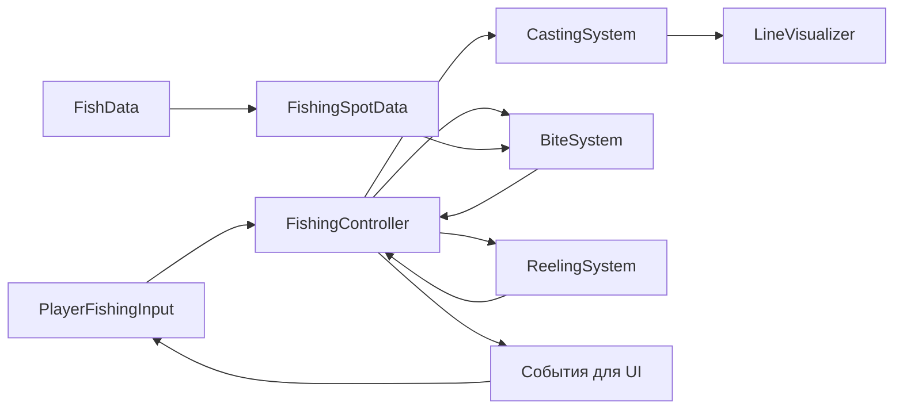

# Курс «Собираем игру-рыбалку в Unity»

Возраст: 13–15 лет  
Уровень: ученик уже знает основы Unity и C#  
Продолжительность: 10 занятий по 60 минут  
Проект: `MyFishingGame`, Unity `6000.0.77f1`

## Что получится в конце

Ты соберёшь существующие части проекта в один повторяемый игровой цикл:

```text
Главное меню
    ↓
Перемещение по острову
    ↓
Заброс удочки в воду
    ↓
Ожидание поклёвки
    ↓
Мини-игра натяжения лески
    ↓
Рыба поймана или сорвалась
    ↓
Новый заброс
```

Также в игре будут пауза, возврат в главное меню, несколько видов рыб, инвентарь, монеты, продажа улова, покупка наживки и сохранение прогресса.

В занятиях 1–5 мы не создаём новые C#-скрипты, ScriptableObject-ассеты или префабы: сначала собираем устойчивый MVP из существующих частей. В занятиях 6–10 мы аккуратно очищаем сцену, создаём префабы и добавляем новые учебные скрипты и ассеты для экономики.

## Управление финальной версией

| Действие | Клавиша или кнопка |
|---|---|
| Ходьба | `W`, `A`, `S`, `D` |
| Осмотр | движение мыши |
| Прыжок | `Space` |
| Заброс | `Space` или правая кнопка мыши |
| Натянуть леску | удерживать левую кнопку мыши |
| Ослабить леску | отпустить левую кнопку мыши |
| Отменить рыбалку | `R` |
| Пауза | `Esc` |

> Во время проверки заброса удобнее использовать правую кнопку мыши: тогда `Space` остаётся только прыжком.

## Какие части проекта уже существуют

Главные рабочие файлы находятся в `Assets/scripts`.

| Файл | Задача |
|---|---|
| `Player.cs` | движение игрока, прыжок и обзор мышью |
| `PlayerFishingInput.cs` | команды игрока: заброс и отмена рыбалки |
| `FishingController.cs` | связывает все этапы рыбалки |
| `CastingSystem.cs` | анимирует заброс |
| `LineVisualizer.cs` | рисует леску через `LineRenderer` |
| `BiteSystem.cs` | ждёт поклёвку и выбирает рыбу |
| `ReelingSystem.cs` | управляет мини-игрой вываживания |
| `FishData.cs` | описывает один вид рыбы |
| `FishingSpotData.cs` | описывает место ловли и список рыб |
| `IFishable.cs` | задаёт общие возможности пойманной рыбы |
| `MainMenuUI.cs` | кнопки главного меню |
| `PauseUI.cs` | открытие и закрытие паузы |
| `Scenes.cs` | правильные имена игровых сцен |

Главные данные и сцены:

- `Assets/Карась.asset` — готовые данные рыбы;
- `Assets/NewFishingSpot.asset` — готовая точка ловли;
- `Assets/_Project/Scenes/MainMenu.unity` — главное меню;
- `Assets/_Project/Scenes/Scene1.unity` — игровая сцена.

---

# Занятие 1. Знакомство с проектом и подготовка

## Цель

Понять устройство проекта, проверить запуск сцен и подготовить код к дальнейшей работе.

## Результат занятия

- Unity открывает проект без красных ошибок компиляции.
- Кнопка главного меню загружает `Scene1`.
- Игрок может двигаться и осматриваться.
- Ты понимаешь, какой скрипт отвечает за каждый этап рыбалки.

## 0–5 минут. Открываем проект безопасно

1. Открой Unity Hub.
2. Выбери проект `MyFishingGame`.
3. Репозиторий ожидает Unity `6000.0.77f1`. Лучше использовать именно эту версию.
4. Если установлена только другая версия Unity 6, не соглашайся на массовое обновление ассетов без резервной копии проекта.
5. После открытия выбери `Window → General → Console`.
6. Нажми кнопку **Clear** в Console.

Красные сообщения — ошибки, из-за которых код может не запуститься. Жёлтые сообщения — предупреждения: их тоже важно читать, но они не всегда мешают игре.

## 5–15 минут. Проверяем сцены

1. Открой `File → Build Profiles` или `File → Build Settings` — название зависит от версии Unity.
2. В списке сцен должны находиться:
   - `Assets/_Project/Scenes/MainMenu.unity`;
   - `Assets/_Project/Scenes/Scene1.unity`.
3. У обеих сцен должна стоять галочка.
4. Дважды щёлкни `MainMenu.unity` в окне Project.
5. Нажми **Play**.
6. Нажми игровую кнопку начала игры.

Ожидаемый результат: загружается `Scene1`.

Если Unity пишет `Scene 'Scene1' couldn't be loaded`, ещё раз проверь, что `Scene1` добавлена в список сборки и включена.

## 15–25 минут. Строим карту системы

Рыбалка состоит из небольших систем. Главный контроллер не делает всю работу сам — он передаёт задачи другим компонентам.



Проговори цепочку своими словами:

1. `PlayerFishingInput` узнаёт, что игрок нажал кнопку заброса.
2. `FishingController` запускает `CastingSystem`.
3. `CastingSystem` двигает конец лески, а `LineVisualizer` рисует её.
4. После заброса `BiteSystem` ждёт случайное время.
5. `BiteSystem` берёт возможную рыбу из `FishingSpotData`.
6. `ReelingSystem` запускает мини-игру.
7. `FishingController` сообщает интерфейсу об улове или срыве через события.

## 25–35 минут. Исправляем имя класса игрока

В Unity имя публичного класса `MonoBehaviour` должно совпадать с именем файла. Сейчас файл называется `Player.cs`, а класс внутри — `PlayerMovement`.

1. Открой `Assets/scripts/Player.cs`.
2. Найди строку:

```csharp
public class PlayerMovement : MonoBehaviour
```

3. Замени её на:

```csharp
public class Player : MonoBehaviour
```

4. Сохрани файл.
5. Вернись в Unity и дождись завершения компиляции.
6. Открой `Scene1` и выбери объект `Capsule`.
7. В Inspector компонент игрока больше не должен показывать `Missing Script`.

Имена приватных методов и полей менять не нужно.

## 35–45 минут. Разбираемся с кодировкой комментариев

Часть старых скриптов сохранена в Windows-1251. В VS Code русские комментарии могут выглядеть как нечитаемые символы или набор странных букв. Это не игровая механика, а способ хранения текста.

Для файлов `BiteSystem.cs`, `FishData.cs`, `FishingController.cs`, `FishingSpotData.cs`, `IFishable.cs`, `LineVisualizer.cs` и `ReelingSystem.cs`:

1. Открой один файл в VS Code.
2. Нажми название кодировки в правом нижнем углу.
3. Выбери **Reopen with Encoding**.
4. Выбери **Cyrillic (Windows 1251)**.
5. Убедись, что русский текст стал читаемым.
6. Снова нажми кодировку.
7. Выбери **Save with Encoding → UTF-8**.
8. Повтори для остальных перечисленных файлов.

Не выбирай случайную кодировку и не сохраняй файл, если текст всё ещё нечитаемый.

`CastingSystem.cs` уже имеет UTF-8, но часть его старых комментариев повреждена. На следующем занятии мы заменим этот короткий файл понятной версией.

В Visual Studio используй `File → Save As`, стрелку рядом с кнопкой **Save**, затем **Save with Encoding**. Сначала открой исходный текст как Windows-1251, а сохраняй как UTF-8.

## 45–55 минут. Проверяем игрока и Inspector

1. Открой `Scene1`.
2. Выбери объект `Capsule`.
3. Проверь компонент `Player`:
   - `Character Controller` ссылается на компонент того же объекта;
   - `Speed` равен `5`;
   - `Jump Force` равен `5`;
   - `Gravity Force` равен `9.81`;
   - `Main Camera` назначена;
   - отсутствие `Animator` пока допустимо, потому что код его не использует.
4. Нажми **Play**.
5. Проверь WASD, мышь и прыжок.
6. Останови Play Mode и проверь Console.

## 55–60 минут. Контрольная точка

Ответь без подсказки:

- Почему `FishingController` называют координатором?
- Чем компонент сцены отличается от `ScriptableObject`?
- Почему имя класса `MonoBehaviour` должно совпадать с именем файла?
- Где сначала искать причину, если игра не реагирует на кнопку?

Мини-задание: нарисуй на бумаге цепочку из пяти главных компонентов рыбалки и подпиши стрелки словами «запускает» или «сообщает».

---

# Занятие 2. Вода, цель и заброс

## Цель

Настроить попадание курсора в воду и увидеть анимированный заброс с леской.

## Результат занятия

- Raycast распознаёт только поверхность воды.
- ПКМ или `Space` запускает заброс.
- Леска появляется во время рыбалки и идёт от удочки к выбранной точке.

## 0–5 минут. Вспоминаем Raycast

Raycast — это невидимый луч. В нашей игре он выходит из камеры через положение курсора и ищет коллайдер на слое `Water`.

Для успешного попадания нужны сразу три условия:

1. объект воды виден камере;
2. у воды есть Collider;
3. объект находится на слое `Water`.

Материал воды сам по себе не ловит луч.

## 5–15 минут. Настраиваем воду

1. Открой `Scene1`.
2. В Hierarchy найди `WaterBlock_50m`.
3. Выбери объект и посмотри поле **Layer** в верхней части Inspector.
4. Выбери слой `Water`.
5. Если Unity спросит, применить ли слой к дочерним объектам, выбери **Yes, change children**.
6. Нажми **Add Component**.
7. Добавь `Box Collider`.
8. Оставь `Is Trigger` выключенным.
9. Нажми **Edit Collider** и убедись в Scene View, что зелёная рамка покрывает поверхность воды.
10. Сохрани сцену сочетанием `Ctrl+S`.

В проекте слой `Water` уже существует под номером 4. Создавать новый слой с похожим названием не нужно.

## 15–25 минут. Проверяем входные ссылки

Выбери `Capsule` и найди компонент `PlayerFishingInput`.

Проверь:

- `Current Fishing Spot` содержит `NewFishingSpot`;
- `Cast Target` оставлен пустым — тогда используется Raycast от мыши;
- `Max Cast Distance` равен `100`.

Теперь найди объекты систем:

1. Объект `FishingController` должен ссылаться на:
   - компонент `CastingSystem`;
   - объект `BiteSystem`;
   - объект `ReelingSystem`;
   - данные `NewFishingSpot`;
   - данные `Карась`.
2. На объекте с `CastingSystem` должны быть назначены:
   - `Line Visual` — компонент `LineVisualizer`;
   - `Cast Origin` — маленький Transform на конце удочки.
3. На том же объекте должен быть `LineRenderer`.
4. У `LineRenderer` включи **Use World Space**.
5. Поставь небольшую ширину лески, например `0.02` в начале и в конце.

## 25–40 минут. Приводим CastingSystem в понятный вид

Полностью замени содержимое существующего `Assets/scripts/CastingSystem.cs` следующим кодом. Новый файл создавать не нужно.

```csharp
using System;
using UnityEngine;
using Fishing.Core;
using Fishing.Visual;

namespace Fishing.Systems
{
    public class CastingSystem : MonoBehaviour
    {
        [Header("Настройки заброса")]
        [SerializeField] private float castDuration = 1.5f;
        [SerializeField] private AnimationCurve heightCurve =
            AnimationCurve.EaseInOut(0, 0, 1, 0);

        [Header("Ссылки")]
        [SerializeField] private LineVisualizer lineVisual;
        [SerializeField] private Transform castOrigin;

        private Action onCompleteCallback;
        private Vector3 targetPosition;
        private float castProgress;
        private bool isCasting;

        public void Initialize(FishingController controller)
        {
            // Контроллер пока не нужен: результат возвращаем через callback.
        }

        public void StartCast(Vector3 target, Action callback)
        {
            targetPosition = target;
            onCompleteCallback = callback;
            castProgress = 0f;
            isCasting = true;

            lineVisual?.EnableLine(true);
            Debug.Log($"Заброс в точку {targetPosition}");
        }

        private void Update()
        {
            if (!isCasting)
                return;

            castProgress += Time.deltaTime / castDuration;

            if (castProgress >= 1f)
            {
                lineVisual?.UpdateLine(castOrigin.position, targetPosition);
                isCasting = false;
                onCompleteCallback?.Invoke();
                return;
            }

            Vector3 currentPosition = Vector3.Lerp(
                castOrigin.position,
                targetPosition,
                castProgress
            );

            currentPosition.y += heightCurve.Evaluate(castProgress) * 2f;
            lineVisual?.UpdateLine(castOrigin.position, currentPosition);
        }

        public void ResetCast()
        {
            isCasting = false;
            lineVisual?.EnableLine(false);
        }
    }
}
```

Что здесь важно:

- `Vector3.Lerp` двигает конец лески от удочки к воде;
- `heightCurve` добавляет высоту и превращает прямое движение в дугу;
- callback сообщает контроллеру, что заброс завершён;
- `?.` вызывает метод только тогда, когда ссылка не равна `null`.

## 40–45 минут. Скрываем леску до заброса

Открой `LineVisualizer.cs`. В методе `Awake` после настройки количества точек добавь одну строку:

```csharp
private void Awake()
{
    lineRenderer = GetComponent<LineRenderer>();
    lineRenderer.positionCount = segments;
    lineRenderer.enabled = false; // До заброса леску не показываем.
}
```

## 45–55 минут. Проверяем заброс

1. Вернись в Unity и дождись компиляции.
2. Нажми **Play** в `Scene1`.
3. Наведи центр взгляда или курсор на воду.
4. Нажми ПКМ.
5. В Console должны появиться сообщения о забросе и ожидании поклёвки.
6. Леска должна закончиться на воде.
7. Нажми `R`, чтобы освободить управление перед следующим тестом.
8. Посмотри в небо или на сушу и снова нажми ПКМ.

При клике мимо воды должно появиться предупреждение «Не удалось определить цель для заброса!», а заброс не должен запускаться.

## 55–60 минут. Контрольная точка

Проверь себя:

- Как Collider помогает Raycast?
- Почему одного слоя `Water` недостаточно?
- Что хранится в `castOrigin`?
- Для чего нужен callback в `StartCast`?

Мини-задание: измени `castDuration` на `0.7`, затем на `2.5`, сравни забросы и верни комфортное значение около `1.5`.

---

# Занятие 3. Рыбы, поклёвка и события

## Цель

Настроить данные рыбы, исправить подписку на события и показывать состояние рыбалки на экране.

## Результат занятия

- После заброса система выбирает карася.
- Игрок получает сообщение о поклёвке.
- После улова или срыва состояние на экране меняется.

## 0–5 минут. Данные отдельно от поведения

`FishData` и `FishingSpotData` наследуются от `ScriptableObject`. Они хранят настройки, но не выполняют действия каждый кадр.

Это удобно: один скрипт поведения может работать с разными рыбами и озёрами, если передать ему другие данные.

## 5–15 минут. Проверяем Карася

Выбери `Assets/Карась.asset`.

Проверь значения:

| Поле | Учебное значение | Значение |
|---|---:|---|
| `Fish Name` | `Карась` | имя в сообщениях |
| `Weight Min` | `0.2` | минимальный вес |
| `Weight Max` | `1.5` | максимальный вес |
| `Base Resistance` | `0.5` | базовое сопротивление |
| `Escape Speed` | `0.3` | скорость, с которой рыба устаёт |
| `Experience Reward` | `10` | будущая награда |

Поля `Fish Prefab` и `Icon In UI` пока могут оставаться пустыми: текущий MVP не создаёт модель рыбы в руках и не использует инвентарь.

## 15–20 минут. Проверяем место ловли

Выбери `Assets/NewFishingSpot.asset`.

Проверь:

- `Spot Name` — «Лесное озеро»;
- в `Fish Pool` есть один элемент;
- его `Fish Data` — `Карась`;
- `Spawn Weight` — `100`;
- `Bite Chance Modifier` — `1`.

Вес `100` не означает 100 рыб. Это относительный шанс. Если позже добавить рыбу с весом `20`, карась с весом `100` будет выбираться примерно в пять раз чаще.

На объекте `BiteSystem` в `Scene1` временно поставь:

- `Min Wait Time = 2`;
- `Max Wait Time = 5`.

Так тест не будет занимать почти весь урок.

## 20–40 минут. Исправляем PlayerFishingInput

Сейчас `OnEnable` вызывается раньше `Start`, поэтому ссылка на `FishingController` ещё не получена и события не подписываются. Полностью замени содержимое существующего `PlayerFishingInput.cs` кодом ниже.

```csharp
using TMPro;
using UnityEngine;
using Fishing.Core;
using Fishing.Core.Data;

public class PlayerFishingInput : MonoBehaviour
{
    [Header("Рыбалка")]
    [SerializeField] private FishingSpotData currentFishingSpot;
    [SerializeField] private Transform castTarget;
    [SerializeField] private float maxCastDistance = 100f;

    [Header("Интерфейс")]
    [SerializeField] private TMP_Text statusText;

    private FishingController fishingController;
    private bool isFishingActive;

    private void Start()
    {
        fishingController = FishingController.Instance;

        if (fishingController == null)
        {
            Debug.LogError("FishingController не найден на сцене!");
            enabled = false;
            return;
        }

        fishingController.OnFishHooked += OnFishHooked;
        fishingController.OnFishLanded += OnFishLanded;
        fishingController.OnFishEscaped += OnFishEscaped;

        ShowStatus("Наведи курсор на воду и нажми ПКМ для заброса.");
    }

    private void Update()
    {
        bool pressedCast = Input.GetKeyDown(KeyCode.Space) ||
                           Input.GetMouseButtonDown(1);

        if (pressedCast && !isFishingActive)
            PerformCast();

        if (Input.GetKeyDown(KeyCode.R) && isFishingActive)
            fishingController.OnFishEscape();
    }

    private void PerformCast()
    {
        if (currentFishingSpot == null)
        {
            Debug.LogError("В PlayerFishingInput не назначен Current Fishing Spot!");
            return;
        }

        Vector3 targetPosition = castTarget != null
            ? castTarget.position
            : GetMouseTarget();

        if (targetPosition == Vector3.zero)
        {
            Debug.LogWarning("Не удалось определить цель для заброса!");
            return;
        }

        fishingController.PerformCast(targetPosition, currentFishingSpot);
        isFishingActive = true;
        ShowStatus("Заброс выполнен. Ждём поклёвку...");
    }

    private Vector3 GetMouseTarget()
    {
        if (Camera.main == null)
        {
            Debug.LogError("Камера с тегом MainCamera не найдена!");
            return Vector3.zero;
        }

        Ray ray = Camera.main.ScreenPointToRay(Input.mousePosition);
        int waterLayer = LayerMask.GetMask("Water");

        if (Physics.Raycast(ray, out RaycastHit hit, maxCastDistance, waterLayer))
            return hit.point;

        return Vector3.zero;
    }

    private void OnDestroy()
    {
        if (fishingController == null)
            return;

        fishingController.OnFishHooked -= OnFishHooked;
        fishingController.OnFishLanded -= OnFishLanded;
        fishingController.OnFishEscaped -= OnFishEscaped;
    }

    private void OnFishHooked(FishData fish)
    {
        isFishingActive = true;
        ShowStatus($"Поклёвка! {fish.fishName} на крючке!");
    }

    private void OnFishLanded(FishData fish)
    {
        float weight = Random.Range(fish.weightMin, fish.weightMax);
        isFishingActive = false;
        ShowStatus($"Поймана рыба: {fish.fishName}, {weight:F1} кг!");
    }

    private void OnFishEscaped()
    {
        isFishingActive = false;
        ShowStatus("Рыбалка завершена. Можно сделать новый заброс.");
    }

    private void ShowStatus(string message)
    {
        Debug.Log(message);

        if (statusText != null)
            statusText.text = message;
    }
}
```

Почему подписка теперь работает:

- все `Awake` выполняются до `Start`;
- `FishingController` создаёт `Instance` в `Awake`;
- `PlayerFishingInput` получает готовый `Instance` в своём `Start`;
- `OnDestroy` удаляет подписки, чтобы старый объект не продолжал получать события.

## 40–50 минут. Создаём StatusText в сцене

1. Открой `Scene1`.
2. В Hierarchy выбери `GameObject → UI → Canvas`.
3. Назови Canvas `FishingHUD`.
4. У компонента `Canvas` оставь `Render Mode = Screen Space - Overlay`.
5. У `Canvas Scaler` выбери `Scale With Screen Size`.
6. Поставь `Reference Resolution = 1920 × 1080` и `Match = 0.5`.
7. Если Unity автоматически создала второй `EventSystem`, оставь в сцене только один.
8. Щёлкни правой кнопкой по `FishingHUD` и выбери `UI → Text - TextMeshPro`.
9. Если Unity попросит импортировать TMP Essentials, нажми **Import TMP Essentials**. В этом проекте они уже должны присутствовать.
10. Назови объект `StatusText`.
11. Закрепи его сверху по центру.
12. Поставь размер примерно `900 × 100`, размер шрифта `32`, выравнивание по центру.
13. Выбери `Capsule`.
14. В компоненте `PlayerFishingInput` перетащи `StatusText` в поле `Status Text`.
15. Сохрани сцену.

## 50–55 минут. Проверяем события

1. Запусти `Scene1`.
2. Сделай заброс.
3. Увидь сообщение «Ждём поклёвку...».
4. Подожди 2–5 секунд.
5. Увидь сообщение «Поклёвка!».
6. Пока мини-игра ещё не исправлена, рыба может сорваться — это нормально.
7. Нажми `R` и проверь, что сообщение разрешает новый заброс.

У `BiteSystem` есть 10% шанс «ложной поклёвки», поэтому иногда ожидание начнётся ещё раз.

## 55–60 минут. Контрольная точка

- Чем событие отличается от прямого вызова метода UI?
- Почему мы отписываемся от событий?
- Что означает `spawnWeight`?
- Зачем данные рыбы вынесены из `FishingController`?

Мини-задание: временно поставь `Bite Chance Modifier = 2`, измерь ожидание, затем верни `1`.

---

# Занятие 4. Мини-игра вываживания

## Цель

Сделать понятное управление натяжением лески и визуальную обратную связь.

## Результат занятия

- При поклёвке появляется панель со Slider.
- Удержание ЛКМ увеличивает натяжение, отпускание уменьшает.
- Подсказка помогает удерживать леску в правильной зоне.
- Рыбу можно поймать до окончания таймера.

## 0–10 минут. Правила мини-игры

У нас есть два числа от `0` до `1`:

- `CurrentTension` — натяжение, которым управляет игрок;
- `FishResistance` — сопротивление текущей рыбы.

Если разница между числами меньше половины `targetZoneSize`, натяжение считается правильным и рыба устаёт. Если игрок слишком долго находится вне зоны, таймер заканчивается и рыба срывается.

## 10–25 минут. Создаём панель

1. В `Scene1` выбери `FishingHUD`.
2. Создай `UI → Panel` и назови его `ReelingPanel`.
3. Размести панель внизу по центру, например размером `700 × 180`.
4. Внутри панели создай `UI → Slider` с именем `TensionSlider`.
5. У Slider установи:
   - `Min Value = 0`;
   - `Max Value = 1`;
   - `Value = 0`;
   - `Whole Numbers` выключено;
   - `Interactable` выключено.
6. Внутри панели создай `Text - TextMeshPro` с именем `HintText`.
7. Поставь текст по центру над Slider и размер шрифта около `28`.
8. Сними галочку активности с `ReelingPanel`, чтобы до поклёвки он был скрыт.

## 25–40 минут. Заменяем ReelingSystem

Полностью замени содержимое существующего `Assets/scripts/ReelingSystem.cs`:

```csharp
using TMPro;
using UnityEngine;
using UnityEngine.UI;
using Fishing.Core;
using Fishing.Core.Interfaces;

namespace Fishing.Systems
{
    public class ReelingSystem : MonoBehaviour
    {
        [Header("Настройки мини-игры")]
        [SerializeField] private float fightDuration = 10f;
        [SerializeField] private float targetZoneSize = 0.3f;
        [SerializeField] private float tensionMultiplier = 0.7f;

        [Header("Интерфейс")]
        [SerializeField] private GameObject reelingUI;
        [SerializeField] private Slider tensionSlider;
        [SerializeField] private TMP_Text hintText;

        private FishingController controller;
        private IFishable currentFish;
        private float fightTimer;
        private bool isFighting;

        public float CurrentTension { get; private set; }
        public float FishResistance => currentFish?.CurrentResistance ?? 0f;

        public void Initialize(FishingController fishingController)
        {
            controller = fishingController;
        }

        public void StartFight(IFishable fish)
        {
            currentFish = fish;
            fightTimer = 0f;
            CurrentTension = 0f;
            isFighting = true;

            if (reelingUI != null)
                reelingUI.SetActive(true);

            UpdateUI(false);
            Debug.Log("Мини-игра началась: удерживай и отпускай ЛКМ.");
        }

        private void Update()
        {
            if (!isFighting || currentFish == null)
                return;

            float wantedTension = Input.GetMouseButton(0) ? 1f : 0f;

            CurrentTension = Mathf.MoveTowards(
                CurrentTension,
                wantedTension,
                tensionMultiplier * Time.deltaTime
            );

            float halfZone = targetZoneSize / 2f;
            bool isInTargetZone =
                CurrentTension >= FishResistance - halfZone &&
                CurrentTension <= FishResistance + halfZone;

            UpdateUI(isInTargetZone);

            if (isInTargetZone)
            {
                if (currentFish.ApplyTension(CurrentTension))
                {
                    OnFishTired();
                    return;
                }
            }
            else
            {
                currentFish.ApplyTension(0f);
            }

            fightTimer += Time.deltaTime;

            if (fightTimer >= fightDuration)
            {
                controller.OnFishEscape();
                StopFight();
            }
        }

        private void UpdateUI(bool isInTargetZone)
        {
            if (tensionSlider != null)
                tensionSlider.value = CurrentTension;

            if (hintText == null)
                return;

            string instruction;

            if (isInTargetZone)
                instruction = "Держи так!";
            else if (CurrentTension < FishResistance)
                instruction = "Зажми ЛКМ — натяни леску";
            else
                instruction = "Отпусти ЛКМ — ослабь леску";

            hintText.text =
                $"Леска: {CurrentTension:F2} | Цель: {FishResistance:F2}\n" +
                instruction;
        }

        private void OnFishTired()
        {
            controller.OnFishTired();
            StopFight();
        }

        public void StopFight()
        {
            isFighting = false;
            currentFish = null;
            CurrentTension = 0f;

            if (tensionSlider != null)
                tensionSlider.value = 0f;

            if (reelingUI != null)
                reelingUI.SetActive(false);
        }

        public void ForceEscape()
        {
            if (isFighting)
                controller.OnFishEscape();

            StopFight();
        }
    }
}
```

## 40–47 минут. Исправляем сопротивление рыбы

Открой `FishingController.cs`. Внутри вложенного класса `FishInstance` найди свойство `CurrentResistance` и замени его:

```csharp
public float CurrentResistance => Mathf.Clamp(maxResistance, 0.25f, 0.8f);
```

Теперь найди метод `ApplyTension` внутри того же класса и полностью замени его:

```csharp
public bool ApplyTension(float tensionPower)
{
    // ReelingSystem передаёт значение больше нуля только в верной зоне.
    if (tensionPower > 0f)
        currentTiredness += Time.deltaTime * data.escapeSpeed;
    else
        currentTiredness -= Time.deltaTime * 0.15f;

    currentTiredness = Mathf.Clamp01(currentTiredness);

    if (currentTiredness >= 1f)
    {
        State = FishState.Tired;
        return true;
    }

    return false;
}
```

`maxResistance` уже вычисляется из базового сопротивления и случайного веса рыбы. `Mathf.Clamp` не даёт цели стать слишком лёгкой или недостижимой.

## 47–52 минуты. Соединяем UI и код

1. Вернись в Unity и дождись компиляции.
2. Выбери объект `ReelingSystem`.
3. Проверь параметры:
   - `Fight Duration = 10`;
   - `Target Zone Size = 0.3`;
   - `Tension Multiplier = 0.7`.
4. Перетащи `ReelingPanel` в поле `Reeling UI`.
5. Перетащи `TensionSlider` в поле `Tension Slider`.
6. Перетащи `HintText` в поле `Hint Text`.
7. Сохрани сцену.

Если поля не появились, сначала посмотри Console. Unity не обновит Inspector, пока в проекте есть ошибка компиляции.

## 52–57 минут. Играем

1. Запусти сцену и сделай заброс.
2. Дождись поклёвки.
3. Удерживай ЛКМ, пока значение лески приближается к цели.
4. Отпусти ЛКМ, если значение стало слишком большим.
5. Старайся удерживать подсказку «Держи так!».
6. Поймай рыбу до окончания десяти секунд.
7. Повтори и специально ничего не нажимай, чтобы увидеть срыв.

## 57–60 минут. Контрольная точка

- Зачем используется `Mathf.MoveTowards`?
- Почему Slider имеет диапазон от 0 до 1?
- Чем `CurrentTension` отличается от `FishResistance`?
- Где определяется ширина правильной зоны?

Мини-задание: сравни `Target Zone Size = 0.15` и `0.5`, затем верни `0.3`.

---

# Занятие 5. Собираем единый игровой цикл

## Цель

Правильно завершать каждый этап, исправить переходы между сценами и проверить игру несколько раз подряд.

## Результат занятия

- После улова, срыва и отмены очищаются леска, UI, корутина и мини-игра.
- Игрок всегда может начать следующий заброс.
- Пауза и главное меню не замораживают новую игру.
- Полный цикл проходит не менее трёх раз без ошибок.

## 0–10 минут. Почему нужна очистка состояния

Одновременно могут работать:

- анимация заброса;
- корутина ожидания;
- мини-игра;
- видимая леска;
- UI-панель.

Если остановить только одну часть, остальные продолжат работу. Например, после `R` старая корутина может всё равно вызвать поклёвку. Поэтому завершение должно выключать все системы в одном месте.

## 10–25 минут. Исправляем FishingController

Открой `FishingController.cs`.

После событий добавь поле:

```csharp
private bool isFishingInProgress;
```

Полностью замени метод `PerformCast`:

```csharp
public void PerformCast(Vector3 targetPosition, FishingSpotData spot)
{
    if (isFishingInProgress)
    {
        Debug.LogWarning("Сначала заверши текущую рыбалку!");
        return;
    }

    if (spot == null)
    {
        Debug.LogError("Для заброса не выбрана FishingSpotData!");
        return;
    }

    isFishingInProgress = true;
    currentSpot = spot;
    castingSystem.StartCast(targetPosition, OnCastComplete);
}
```

Полностью замени `OnBiteOccurred`:

```csharp
public void OnBiteOccurred(FishData fishData)
{
    // Защита от запоздавшей корутины после отмены.
    if (!isFishingInProgress || fishData == null)
        return;

    currentFishData = fishData;
    CurrentFish = new FishInstance(fishData);

    CurrentFish.OnHooked();
    OnFishHooked?.Invoke(fishData);
    reelingSystem.StartFight(CurrentFish);
}
```

Полностью замени `OnFishTired` и `OnFishEscape`, а затем добавь общий метод очистки:

```csharp
public void OnFishTired()
{
    if (CurrentFish == null || currentFishData == null)
        return;

    CurrentFish.State = FishState.Landed;
    FishData landedFish = currentFishData;

    Debug.Log($"Рыба {landedFish.fishName} поймана!");
    ResetFishingSystems();
    OnFishLanded?.Invoke(landedFish);
}

public void OnFishEscape()
{
    if (!isFishingInProgress)
        return;

    CurrentFish?.OnEscape();
    ResetFishingSystems();
    OnFishEscaped?.Invoke();
    Debug.Log("Рыбалка завершена без улова.");
}

private void ResetFishingSystems()
{
    biteSystem.StopWaiting();
    reelingSystem.StopFight();
    castingSystem.ResetCast();

    CurrentFish = null;
    currentFishData = null;
    currentSpot = null;
    isFishingInProgress = false;
}
```

Теперь `R`, таймер проигрыша и успешный улов используют одну и ту же очистку.

## 25–32 минуты. Делаем ожидание устойчивым

В `BiteSystem.cs` замени метод `WaitForBite`. Цикл повторяет ожидание после ложной поклёвки, но легко останавливается через `StopWaiting`.

```csharp
private IEnumerator WaitForBite()
{
    while (currentSpot != null)
    {
        float modifier = Mathf.Max(0.1f, currentSpot.biteChanceModifier);
        float waitTime = Random.Range(minWaitTime, maxWaitTime) / modifier;
        yield return new WaitForSeconds(waitTime);

        FishData selectedFish = SelectFishFromPool();

        if (selectedFish == null)
        {
            Debug.LogWarning("В точке ловли нет рыбы!");
            continue;
        }

        if (Random.value < 0.1f)
        {
            Debug.Log("Ложная поклёвка. Ждём ещё...");
            continue;
        }

        waitingCoroutine = null;
        controller.OnBiteOccurred(selectedFish);
        yield break;
    }

    waitingCoroutine = null;
}
```

В конец `StopWaiting` добавь очистку точки:

```csharp
public void StopWaiting()
{
    if (waitingCoroutine != null)
    {
        StopCoroutine(waitingCoroutine);
        waitingCoroutine = null;
    }

    currentSpot = null;
}
```

## 32–40 минут. Исправляем имена сцен

Полностью замени содержимое существующего `Scenes.cs`:

```csharp
public static class Scenes
{
    public const string MainMenu = "MainMenu";
    public const string Gameplay = "Scene1";
}
```

Полностью замени `MainMenuUI.cs`:

```csharp
using UnityEngine;
using UnityEngine.SceneManagement;

public class MainMenuUI : MonoBehaviour
{
    public void StartGame()
    {
        Time.timeScale = 1f;
        SceneManager.LoadScene(Scenes.Gameplay);
    }

    public void ExitGame()
    {
        Debug.Log("Выход из игры");
        Application.Quit();
    }
}
```

В `PauseUI.cs` замени только `BackToMainMenu`:

```csharp
public void BackToMainMenu()
{
    Time.timeScale = 1f;
    Cursor.lockState = CursorLockMode.None;
    SceneManager.LoadScene(Scenes.MainMenu);
}
```

Без `Time.timeScale = 1f` следующая игровая сцена может загрузиться в замороженном состоянии.

## 40–48 минут. Проверяем кнопки и паузу

В `MainMenu`:

1. Выбери кнопку начала игры.
2. В списке `On Click()` должен быть объект с `MainMenuUI`.
3. Выбери метод `MainMenuUI → StartGame`.
4. Для кнопки выхода выбери `MainMenuUI → ExitGame`.

В `Scene1`:

1. Выбери объект с компонентом `PauseUI`.
2. В поле `Toggle` должна быть назначена команда `UI/OpenPauseMenu` из `InputSystem_Actions`.
3. Эта команда уже привязана к `Esc`.
4. В поле `Root` должна быть назначена панель паузы, а не весь Canvas игрового HUD.
5. На кнопке продолжения выбери `PauseUI → BackToGame`.
6. На кнопке выхода в меню выбери `PauseUI → BackToMainMenu`.
7. До запуска панель паузы должна быть выключена.

## 48–57 минут. Финальный тест

Открой `MainMenu` и начни игру именно оттуда.

| № | Действие | Ожидаемый результат |
|---:|---|---|
| 1 | Нажать начало игры | открывается `Scene1` |
| 2 | Пройтись и осмотреться | движение и камера работают |
| 3 | Нажать ПКМ по суше | появляется предупреждение, заброса нет |
| 4 | Нажать ПКМ по воде | появляется леска и сообщение ожидания |
| 5 | Снова нажать заброс | второй процесс не начинается |
| 6 | Дождаться поклёвки | появляется `ReelingPanel` |
| 7 | Удерживать и отпускать ЛКМ | Slider плавно движется |
| 8 | Удержать правильную зону | появляется сообщение об улове |
| 9 | Сделать новый заброс | цикл начинается заново |
| 10 | Нажать `R` во время ожидания | леска скрывается, новый заброс доступен |
| 11 | Нажать `R` во время мини-игры | UI скрывается, старый таймер не срабатывает |
| 12 | Нажать `Esc` два раза | пауза открывается и закрывается |
| 13 | Из паузы выйти в меню | открывается `MainMenu` |
| 14 | Снова начать игру | движение и таймеры не заморожены |

Пройди полный цикл «заброс → поклёвка → результат» три раза. После каждого раза проверяй Console.

## 57–60 минут. Итог

Объясни своими словами:

- какие системы запускаются после нажатия ПКМ;
- зачем контроллеру общий метод очистки;
- как события связывают игровую механику и UI;
- какие настройки можно менять без переписывания механики.

Мини-задание после первой части: подбери собственные значения времени ожидания, ширины правильной зоны и длительности борьбы. Меняй только одно значение за тест — так легче понять его влияние.

---

# Проверка первой части: MVP

Поставь отметку после успешной проверки каждого пункта.

- [ ] Unity компилирует проект без красных ошибок.
- [ ] В сцене нет компонентов `Missing Script`.
- [ ] `MainMenu` загружает `Scene1`.
- [ ] WASD, мышь и прыжок работают.
- [ ] Вода имеет `BoxCollider` и слой `Water`.
- [ ] Заброс мимо воды не запускается.
- [ ] Заброс в воду показывает леску.
- [ ] Во время одной рыбалки нельзя создать второй процесс.
- [ ] `NewFishingSpot` выбирает `Карась`.
- [ ] Поклёвка отображается в `StatusText`.
- [ ] При поклёвке открывается `ReelingPanel`.
- [ ] Удержание и отпускание ЛКМ изменяет Slider.
- [ ] Правильное натяжение позволяет поймать рыбу.
- [ ] По окончании таймера рыба срывается.
- [ ] После улова можно забросить снова.
- [ ] После срыва можно забросить снова.
- [ ] `R` отменяет заброс, ожидание и мини-игру.
- [ ] После завершения леска скрывается.
- [ ] `Esc` открывает и закрывает паузу.
- [ ] Возврат в меню восстанавливает `Time.timeScale`.
- [ ] Полный игровой цикл работает три раза подряд.

# Если что-то не работает

## Unity не показывает новые поля в Inspector

1. Открой Console.
2. Исправь первую красную ошибку — остальные могут быть её следствием.
3. Проверь фигурные скобки и точки с запятой.
4. Проверь, что `using TMPro;` и `using UnityEngine.UI;` находятся в начале нужного файла.
5. Дождись окончания компиляции.

## На компоненте написано Missing Script

- Убедись, что в `Player.cs` объявлен `public class Player : MonoBehaviour`.
- У остальных компонентов имя класса должно совпадать с именем файла.
- Не создавай копии классов с такими же именами.

## Вода видна, но заброс не работает

- У `WaterBlock_50m` должен быть `BoxCollider`.
- Его слой должен называться точно `Water`.
- `Max Cast Distance` должен быть достаточно большим, например `100`.
- Камера должна иметь тег `MainCamera`.
- Зелёная рамка Collider должна покрывать поверхность воды.

## Появляется NullReferenceException

Щёлкни по сообщению в Console: Unity откроет строку, где отсутствует ссылка. Затем проверь Inspector.

Чаще всего забывают назначить:

- три системы в `FishingController`;
- `Line Visual` и `Cast Origin` в `CastingSystem`;
- `Current Fishing Spot` в `PlayerFishingInput`;
- `Status Text` в `PlayerFishingInput`;
- `Reeling UI`, `Tension Slider` и `Hint Text` в `ReelingSystem`;
- `Root` и `Toggle` в `PauseUI`.

## Поклёвка не происходит

- Проверь, что `NewFishingSpot` назначен и в нём есть `Карась`.
- `Spawn Weight` должен быть больше нуля.
- `Bite Chance Modifier` должен быть больше нуля.
- Для теста поставь ожидание 2–5 секунд.
- Помни о 10% вероятности ложной поклёвки.

## Панель натяжения не появляется

- `ReelingPanel` должен быть назначен в `Reeling UI`.
- В начале сцены панель выключена — это правильно.
- Сам объект `FishingHUD` должен быть включён.
- Проверь, появилось ли сообщение о поклёвке.

## Slider не двигается

- У Slider должны быть пределы `0` и `1`.
- Проверь ссылку `Tension Slider`.
- ЛКМ нужно удерживать после поклёвки, а не во время ожидания.
- Убедись, что игра не стоит на паузе и `Time.timeScale` не равен нулю.

## Событие срабатывает несколько раз

- В `PlayerFishingInput` подписка должна находиться только в `Start`.
- Отписка должна находиться только в `OnDestroy`.
- Удали старые методы `OnEnable` и `OnDisable` из этого скрипта после полной замены.

## Сцена не найдена

- Проверь точное имя файла: `MainMenu` и `Scene1`.
- Проверь константы в `Scenes.cs`.
- Добавь обе сцены в Build Settings или Build Profiles.
- Не используй старое имя `GamePlay`.

## После меню игра заморожена

- В `PauseUI.BackToMainMenu` должна быть строка `Time.timeScale = 1f;`.
- В `MainMenuUI.StartGame` тоже должна быть страховочная строка `Time.timeScale = 1f;`.

# Часть 2. Экономика и магазин

Перед началом второй части полностью пройди чек-лист MVP. Экономика опирается на события улова, поэтому не стоит добавлять магазин, пока базовая рыбалка работает нестабильно.

Новый цикл игры будет выглядеть так:

```text
Поймать несколько рыб
        ↓
Рыба попадает в инвентарь
        ↓
Открыть магазин
        ↓
Продать весь улов
        ↓
Получить монеты
        ↓
Купить наживку
        ↓
Быстрее дождаться новой поклёвки
```

---

# Занятие 6. Чистая сцена и правильные префабы

## Цель

Безопасно закончить текущую чистку `Scene1`, привести Hierarchy в понятный вид и вынести повторяемые объекты в префабы, не сломав MVP.

## Результат занятия

- В сцене остались только нужные объекты.
- Объекты сгруппированы по назначению.
- Повторяемые декорации и UI-карточка магазина стали префабами.
- Системные объекты со ссылками на сцену не были случайно превращены в неподходящие префабы.
- После чистки полный цикл рыбалки по-прежнему работает.

## Главное правило чистки

Не удаляй объект сразу. Сначала выключи его галочкой в Inspector, запусти игру и проверь последствия. Удаляй только после успешного теста.

## 0–5 минут. Создаём точку возврата

Выбери один способ:

1. Сделай отдельный Git-коммит перед чисткой; или
2. В окне Project продублируй `Scene1`, назови копию `Scene1_BeforeCleanup` и не добавляй её в Build Settings.

После этого работай только в основной `Scene1`.

> Резервная сцена нужна для восстановления объектов, а не для запуска игры. Не держи две почти одинаковые сцены в Build Settings.

## 5–15 минут. Строим понятную Hierarchy

Создай в корне `Scene1` пустые объекты:

```text
WORLD
GAMEPLAY
SYSTEMS
UI
LIGHTING
```

Распредели объекты:

| Родитель | Что поместить внутрь |
|---|---|
| `WORLD` | остров, вода, земля, камни, деревья, палатки и декорации |
| `GAMEPLAY` | `Capsule`, удочка, будущая точка магазина |
| `SYSTEMS` | `FishingController`, `BiteSystem`, `ReelingSystem` |
| `UI` | `FishingHUD`, `PauseUI`, существующий `shopUI`, единственный `EventSystem` |
| `LIGHTING` | Directional Light, Global Volume и другие настройки освещения |

Перетаскивание объекта к новому родителю в Hierarchy обычно сохраняет его мировое положение. После перемещения всё равно сравни Scene View до и после.

Не помещай `Main Camera` отдельно от игрока, если она уже является дочерним объектом `Capsule`: иначе камера перестанет двигаться вместе с персонажем.

## 15–25 минут. Ищем лишнее

Проверь сцену по списку:

- должна быть одна активная `Main Camera`;
- должен быть один `EventSystem`;
- не должно быть двух одинаковых источников основного света;
- не должно быть объектов `Missing Script`;
- демонстрационные камеры и UI из импортированных пакетов должны быть выключены или удалены;
- невидимые копии острова, воды и земли не должны лежать друг в друге;
- старый тестовый UI не должен перекрывать `FishingHUD` и `PauseUI`.

Для каждого подозрительного объекта:

1. запомни его имя и родителя;
2. выключи объект;
3. запусти сцену;
4. проверь движение, воду, заброс, поклёвку, UI и паузу;
5. только после этого реши, удалять ли объект.

## 25–40 минут. Создаём префабы

Создай папки:

```text
Assets/_Project/Prefabs/Environment
Assets/_Project/Prefabs/Gameplay
Assets/_Project/Prefabs/UI
```

Хорошие кандидаты для префабов:

- повторяющиеся камни, деревья, бочки и фонари;
- декорация места рыбалки;
- визуальный объект магазина;
- повторяющаяся карточка товара;
- существующая карточка `Assets/_Project/UI/ShopUI/наживка.prefab`.

Плохие кандидаты на этом этапе:

- `FishingController`, потому что он хранит ссылки на другие объекты сцены;
- `EventSystem`;
- `Main Camera` отдельно от игрока;
- весь `UI` одним огромным префабом;
- весь остров вместе со всеми системами;
- `PlayerData`, который появится на следующем занятии и будет ссылаться на UI сцены.

Чтобы создать префаб:

1. выбери аккуратно настроенный объект в Hierarchy;
2. перетащи его в подходящую папку Project;
3. убедись, что объект в Hierarchy стал синим;
4. измени один экземпляр и посмотри раздел **Overrides**;
5. нажимай **Apply** только для изменений, которые нужны всем экземплярам;
6. положение конкретного камня в сцене не применяй ко всем камням.

## 40–50 минут. Готовим префаб карточки наживки

В проекте уже есть `Assets/_Project/UI/ShopUI/наживка.prefab`.

1. Дважды щёлкни префаб, чтобы открыть Prefab Mode.
2. Назови корневой объект `BaitShopItem`.
3. Переименуй дочерние элементы понятно: `NameText`, `PriceText`, `BuyButton`, `Icon`.
4. Не добавляй код покупки — это будет на занятии 9.
5. Удали только действительно пустые тестовые дочерние объекты.
6. Выйди из Prefab Mode стрелкой в левом верхнем углу.

Если текущий префаб сильно сломан, оставь его как пример и создай новый UI-префаб `BaitShopItem` на основе обычной кнопки. Не удаляй исходник до проверки нового варианта.

## 50–57 минут. Регрессионный тест

После чистки обязательно проверь:

- главное меню открывает `Scene1`;
- игрок не проваливается сквозь землю;
- камера следует за игроком;
- вода видна и принимает Raycast;
- удочка и `castOrigin` остались на месте;
- все три ссылки `FishingController` назначены;
- ловля и повторный заброс работают;
- `FishingHUD`, пауза и `shopUI` не перекрывают друг друга.

## 57–60 минут. Контрольная точка

- Чем экземпляр префаба отличается от самого prefab asset?
- Почему `FishingController` пока не стоит превращать в префаб?
- Чем **Apply** отличается от изменения одного экземпляра?
- Почему безопаснее сначала выключить объект и только потом удалить?

Мини-задание: создай два экземпляра одного декоративного префаба, измени общий материал через Prefab Mode, а положение оставь разным.

---

# Занятие 7. Несколько рыб и инвентарь улова

## Цель

Добавить несколько видов рыб, сохранить точный вес пойманной рыбы и складывать улов в простой инвентарь.

## Результат занятия

- В озере встречаются карась, окунь и щука с разными шансами.
- Вес рыбы создаётся один раз и используется и в борьбе, и в награде.
- Пойманная рыба попадает в `FishInventory`.
- Console показывает количество и стоимость всего улова.

## 0–8 минут. Проектируем данные экономики

Стоимость одной рыбы будет вычисляться так:

```text
стоимость = вес × цена за килограмм
```

В `FishData.cs` после блока наград добавь:

```csharp
[Header("Экономика")]
[Min(1)] public int pricePerKilogram = 20;
```

Не записывай цену конкретного улова в `FishData`: один карась может весить `0.3` кг, а другой — `1.2` кг.

## 8–20 минут. Создаём новые FishData

Создай папку `Assets/_Project/Data/Fish`.

Перемести туда `Карась.asset` через окно Unity Project, чтобы Unity сохранила GUID и ссылки. Не перемещай `.asset` через Проводник Windows.

Создай ещё два ассета через `Create → Fishing → Fish Data`:

| Поле | Карась | Окунь | Щука |
|---|---:|---:|---:|
| `Weight Min` | 0.2 | 0.3 | 1.5 |
| `Weight Max` | 1.5 | 2.0 | 6.0 |
| `Base Resistance` | 0.5 | 0.6 | 0.8 |
| `Escape Speed` | 0.30 | 0.25 | 0.18 |
| `Price Per Kilogram` | 20 | 35 | 70 |
| `Experience Reward` | 10 | 20 | 50 |

В `NewFishingSpot` поставь размер `Fish Pool = 3`:

| Рыба | Spawn Weight |
|---|---:|
| Карась | 60 |
| Окунь | 30 |
| Щука | 10 |

Сумма не обязана равняться 100, но при сумме 100 проценты легче объяснять.

## 20–30 минут. Один вес на всю рыбу

В `IFishable.cs` добавь свойство рядом с `CurrentResistance`:

```csharp
/// <summary> Вес конкретной пойманной рыбы </summary>
float Weight { get; }
```

Внутри `FishInstance` в `FishingController.cs` добавь:

```csharp
public float Weight { get; }
```

Замени конструктор `FishInstance`:

```csharp
public FishInstance(FishData data)
{
    this.data = data;
    Weight = UnityEngine.Random.Range(data.weightMin, data.weightMax);
    maxResistance = data.baseResistance * Weight;
    State = FishState.Hooked;
}
```

Теперь один и тот же `Weight` влияет на сопротивление и передаётся в инвентарь.

Измени объявление события в `FishingController`:

```csharp
public event Action<FishData, float> OnFishLanded;
```

В `OnFishTired` сохрани вес до очистки систем:

```csharp
public void OnFishTired()
{
    if (CurrentFish == null || currentFishData == null)
        return;

    CurrentFish.State = FishState.Landed;
    FishData landedFish = currentFishData;
    float landedWeight = CurrentFish.Weight;

    Debug.Log($"Поймана рыба {landedFish.fishName}, {landedWeight:F1} кг!");
    ResetFishingSystems();
    OnFishLanded?.Invoke(landedFish, landedWeight);
}
```

## 30–43 минут. Создаём FishInventory.cs

Создай папку `Assets/_Project/Scripts/Economy`, а в ней новый скрипт `FishInventory.cs`:

```csharp
using System;
using System.Collections.Generic;
using UnityEngine;
using Fishing.Core.Data;

[Serializable]
public class CaughtFish
{
    public string fishName;
    public float weight;
    public int price;

    public CaughtFish(FishData fishData, float fishWeight)
    {
        fishName = fishData.fishName;
        weight = fishWeight;
        price = Mathf.Max(1,
            Mathf.RoundToInt(fishWeight * fishData.pricePerKilogram));
    }
}

public class FishInventory : MonoBehaviour
{
    [SerializeField] private List<CaughtFish> caughtFish =
        new List<CaughtFish>();

    public event Action OnInventoryChanged;

    public int FishCount => caughtFish.Count;

    public int TotalValue
    {
        get
        {
            int total = 0;

            foreach (CaughtFish fish in caughtFish)
                total += fish.price;

            return total;
        }
    }

    public void AddFish(FishData fishData, float weight)
    {
        CaughtFish newFish = new CaughtFish(fishData, weight);
        caughtFish.Add(newFish);
        OnInventoryChanged?.Invoke();

        Debug.Log(
            $"В инвентаре рыб: {FishCount}. " +
            $"Стоимость улова: {TotalValue} монет."
        );
    }

    public int SellAll()
    {
        int money = TotalValue;
        caughtFish.Clear();
        OnInventoryChanged?.Invoke();
        return money;
    }

    public void Clear()
    {
        caughtFish.Clear();
        OnInventoryChanged?.Invoke();
    }
}
```

Почему `CaughtFish` не хранит ссылку на `FishData`:

- имя, вес и цена фиксируются в момент улова;
- изменение цены ассета позже не меняет уже пойманную рыбу;
- такие простые данные будет легче сохранить на занятии 10.

## 43–50 минут. Подключаем инвентарь

1. В `Scene1` внутри `GAMEPLAY` создай пустой объект `PlayerData`.
2. Добавь ему компонент `FishInventory`.
3. В `PlayerFishingInput.cs` добавь поле:

```csharp
[Header("Экономика")]
[SerializeField] private FishInventory fishInventory;
```

4. Замени обработчик улова:

```csharp
private void OnFishLanded(FishData fish, float weight)
{
    isFishingActive = false;

    if (fishInventory != null)
        fishInventory.AddFish(fish, weight);
    else
        Debug.LogError("В PlayerFishingInput не назначен FishInventory!");

    ShowStatus($"Поймана рыба: {fish.fishName}, {weight:F1} кг!");
}
```

5. Перетащи `PlayerData` с компонентом `FishInventory` в новое поле игрока.
6. Дождись компиляции и проверь, что подписка на `OnFishLanded` больше не подчёркнута красным.

## 50–57 минут. Проверяем вероятности и инвентарь

1. Для быстрого теста поставь ожидание поклёвки 1–2 секунды.
2. Поймай не менее пяти рыб.
3. Записывай виды рыб в таблицу на бумаге.
4. После каждого улова смотри количество и стоимость в Console.
5. Убедись, что щука встречается реже карася.
6. Верни ожидание 2–5 секунд.

Пять попыток не доказывают точную вероятность. Случайность может дать несколько щук подряд, хотя шанс щуки ниже.

## 57–60 минут. Контрольная точка

- Почему вес генерируется в `FishInstance`, а не в UI?
- Почему цена уже пойманной рыбы фиксируется?
- Для чего `FishInventory` вызывает событие?
- Чем `FishData` отличается от `CaughtFish`?

Мини-задание: вычисли вручную цену окуня весом `1.4` кг при цене `35` монет за килограмм и сравни с игрой.

---

# Занятие 8. Монеты и продажа улова

## Цель

Добавить кошелёк, открыть существующий `shopUI` и продавать весь улов одной кнопкой.

## Результат занятия

- У игрока есть стартовые монеты.
- UI показывает число рыб, стоимость улова и баланс.
- Кнопка магазина останавливает игру и освобождает курсор.
- Кнопка продажи переводит стоимость улова в кошелёк.

## 0–10 минут. Правила транзакции

Продажа должна происходить в таком порядке:

```text
1. Посчитать стоимость инвентаря
2. Запомнить количество рыб
3. Очистить инвентарь
4. Добавить стоимость в кошелёк
5. Обновить UI
```

Если сначала очистить список, его стоимость станет равна нулю.

## 10–20 минут. Создаём PlayerWallet.cs

В папке `Assets/_Project/Scripts/Economy` создай `PlayerWallet.cs`:

```csharp
using System;
using UnityEngine;

public class PlayerWallet : MonoBehaviour
{
    [SerializeField] private int startingCoins = 50;

    public event Action OnCoinsChanged;
    public int Coins { get; private set; }

    private void Awake()
    {
        Coins = Mathf.Max(0, startingCoins);
    }

    public void AddCoins(int amount)
    {
        if (amount <= 0)
            return;

        Coins += amount;
        OnCoinsChanged?.Invoke();
    }

    public bool TrySpendCoins(int amount)
    {
        if (amount <= 0 || Coins < amount)
            return false;

        Coins -= amount;
        OnCoinsChanged?.Invoke();
        return true;
    }

    public void ResetWallet()
    {
        Coins = Mathf.Max(0, startingCoins);
        OnCoinsChanged?.Invoke();
    }
}
```

Добавь `PlayerWallet` на объект `PlayerData` и поставь `Starting Coins = 50`.

## 20–38 минут. Создаём ShopController.cs

В той же папке создай `ShopController.cs`:

```csharp
using TMPro;
using UnityEngine;

public class ShopController : MonoBehaviour
{
    [Header("Системы")]
    [SerializeField] private FishInventory fishInventory;
    [SerializeField] private PlayerWallet playerWallet;

    [Header("Интерфейс магазина")]
    [SerializeField] private GameObject shopRoot;
    [SerializeField] private TMP_Text coinsText;
    [SerializeField] private TMP_Text fishText;
    [SerializeField] private TMP_Text messageText;

    private void Start()
    {
        fishInventory.OnInventoryChanged += RefreshUI;
        playerWallet.OnCoinsChanged += RefreshUI;

        shopRoot.SetActive(false);
        RefreshUI();
    }

    private void OnDestroy()
    {
        if (fishInventory != null)
            fishInventory.OnInventoryChanged -= RefreshUI;

        if (playerWallet != null)
            playerWallet.OnCoinsChanged -= RefreshUI;

        Time.timeScale = 1f;
    }

    public void OpenShop()
    {
        shopRoot.SetActive(true);
        Cursor.lockState = CursorLockMode.None;
        Time.timeScale = 0f;
        RefreshUI();
    }

    public void CloseShop()
    {
        shopRoot.SetActive(false);
        Cursor.lockState = CursorLockMode.Locked;
        Time.timeScale = 1f;
    }

    public void SellAllFish()
    {
        int fishCount = fishInventory.FishCount;
        int money = fishInventory.SellAll();

        if (money <= 0)
        {
            ShowMessage("В инвентаре нет рыбы.");
            return;
        }

        playerWallet.AddCoins(money);
        ShowMessage($"Продано рыб: {fishCount}. Получено: {money} монет.");
    }

    private void RefreshUI()
    {
        if (coinsText != null)
            coinsText.text = $"Монеты: {playerWallet.Coins}";

        if (fishText != null)
        {
            fishText.text =
                $"Рыб: {fishInventory.FishCount}\n" +
                $"Стоимость: {fishInventory.TotalValue}";
        }
    }

    private void ShowMessage(string message)
    {
        Debug.Log(message);

        if (messageText != null)
            messageText.text = message;

        RefreshUI();
    }
}
```

`ShopController` размести на `PlayerData`, а не на выключаемом `shopUI`. Тогда кнопка открытия сможет найти активный компонент.

## 38–48 минут. Настраиваем shopUI

В `Scene1` уже есть объект `shopUI` и элементы с именами `Balance`, `Items`, `TopBar`.

1. Перемести `shopUI` под родителя `UI`.
2. Используй существующий TMP-текст внутри `Balance` как `CoinsText` или создай новый.
3. Создай TMP-текст `FishText` со строками количества и стоимости.
4. Создай TMP-текст `ShopMessageText` для результата операции.
5. Создай кнопку `SellAllButton` с надписью «Продать весь улов».
6. Создай или найди кнопку `CloseButton`.
7. На `FishingHUD`, но вне `shopUI`, создай кнопку `OpenShopButton` с надписью «Магазин».
8. У `shopUI` отключи активность до запуска игры.

На компоненте `ShopController` назначь:

- `Fish Inventory` → компонент с `PlayerData`;
- `Player Wallet` → компонент с `PlayerData`;
- `Shop Root` → `shopUI`;
- `Coins Text` → текст баланса;
- `Fish Text` → текст улова;
- `Message Text` → текст сообщения.

События кнопок:

| Кнопка | Метод |
|---|---|
| `OpenShopButton` | `ShopController.OpenShop` |
| `CloseButton` | `ShopController.CloseShop` |
| `SellAllButton` | `ShopController.SellAllFish` |

## 48–57 минут. Проверяем продажу

1. Запусти игру: баланс должен быть `50`.
2. Открой магазин без рыбы и нажми продажу.
3. Увидь сообщение «В инвентаре нет рыбы».
4. Закрой магазин и поймай две рыбы.
5. Запомни стоимость улова.
6. Открой магазин и продай улов.
7. Проверь: инвентарь стал пустым, а баланс увеличился ровно на стоимость.
8. Закрой магазин и убедись, что движение снова работает.

## 57–60 минут. Контрольная точка

- Почему продажа сначала запоминает стоимость?
- Зачем кошелёк запрещает отрицательные операции?
- Почему `ShopController` не находится внутри выключаемого `shopUI`?
- Зачем магазин меняет `Time.timeScale` и курсор?

Мини-задание: начни с 50 монет, продай улов за 84 монеты и вычисли ожидаемый баланс до нажатия кнопки.

---

# Занятие 9. Покупка наживки

## Цель

Добавить один понятный товар — тесто для рыбалки — и связать покупку с реальной скоростью поклёвки.

## Результат занятия

- Наживка описывается отдельным ScriptableObject.
- За монеты покупается упаковка теста.
- Одна единица наживки расходуется на один успешный заброс.
- Пока есть тесто, ожидание поклёвки становится короче.
- Существующий префаб карточки наживки работает как товар магазина.

## 0–10 минут. Создаём BaitData.cs

Создай папку `Assets/_Project/Data/Bait` и скрипт `BaitData.cs` в папке экономики:

```csharp
using UnityEngine;

[CreateAssetMenu(fileName = "NewBait", menuName = "Fishing/Bait Data")]
public class BaitData : ScriptableObject
{
    public string baitName = "Тесто";
    [Min(1)] public int price = 15;
    [Min(1)] public int usesPerPurchase = 5;

    [Tooltip("Во сколько раз быстрее происходит поклёвка")]
    [Range(1f, 3f)] public float biteSpeedMultiplier = 1.7f;
}
```

Создай ассет `Тесто` через `Create → Fishing → Bait Data`:

- `Bait Name = Тесто`;
- `Price = 15`;
- `Uses Per Purchase = 5`;
- `Bite Speed Multiplier = 1.7`.

## 10–23 минут. Создаём BaitInventory.cs

Создай `BaitInventory.cs`:

```csharp
using System;
using UnityEngine;

public class BaitInventory : MonoBehaviour
{
    [SerializeField] private BaitData currentBait;
    [SerializeField] private int usesRemaining;

    public event Action OnBaitChanged;

    public BaitData CurrentBait => currentBait;
    public int UsesRemaining => usesRemaining;

    public void AddBait(BaitData bait)
    {
        if (bait == null)
            return;

        if (currentBait != bait)
        {
            currentBait = bait;
            usesRemaining = 0;
        }

        usesRemaining += bait.usesPerPurchase;
        OnBaitChanged?.Invoke();
    }

    public float UseBait()
    {
        if (currentBait == null || usesRemaining <= 0)
            return 1f;

        usesRemaining--;
        OnBaitChanged?.Invoke();
        return currentBait.biteSpeedMultiplier;
    }

    public void ResetBait()
    {
        usesRemaining = 0;
        OnBaitChanged?.Invoke();
    }
}
```

Добавь `BaitInventory` на `PlayerData` и назначь ассет `Тесто` в `Current Bait`. `Uses Remaining` оставь равным нулю.

## 23–35 минут. Связываем наживку с BiteSystem

В `BiteSystem.cs` добавь поля:

```csharp
[Header("Наживка")]
[SerializeField] private BaitInventory baitInventory;

private float currentBaitModifier = 1f;
```

Замени `StartWaiting`:

```csharp
public void StartWaiting(FishingSpotData spot)
{
    currentSpot = spot;
    currentBaitModifier = baitInventory != null
        ? baitInventory.UseBait()
        : 1f;

    if (waitingCoroutine != null)
        StopCoroutine(waitingCoroutine);

    waitingCoroutine = StartCoroutine(WaitForBite());
}
```

В `WaitForBite` замени вычисление `modifier`:

```csharp
float modifier = Mathf.Max(
    0.1f,
    currentSpot.biteChanceModifier * currentBaitModifier
);
```

В конце `StopWaiting` после `currentSpot = null;` добавь:

```csharp
currentBaitModifier = 1f;
```

Теперь одна наживка расходуется в начале ожидания. Ложная поклёвка не расходует вторую наживку, потому что остаётся внутри той же корутины.

В Unity перетащи `PlayerData` с `BaitInventory` в поле `Bait Inventory` компонента `BiteSystem`.

## 35–47 минут. Добавляем покупку в ShopController

В `ShopController.cs` добавь поля:

```csharp
[SerializeField] private BaitInventory baitInventory;
[SerializeField] private TMP_Text baitText;
```

В `Start` добавь подписку:

```csharp
baitInventory.OnBaitChanged += RefreshUI;
```

В `OnDestroy` добавь отписку:

```csharp
if (baitInventory != null)
    baitInventory.OnBaitChanged -= RefreshUI;
```

Добавь публичный метод покупки:

```csharp
public void BuyBait(BaitData bait)
{
    if (bait == null)
    {
        ShowMessage("Данные наживки не назначены.");
        return;
    }

    if (!playerWallet.TrySpendCoins(bait.price))
    {
        ShowMessage("Недостаточно монет.");
        return;
    }

    baitInventory.AddBait(bait);
    ShowMessage(
        $"Куплено: {bait.baitName}, " +
        $"{bait.usesPerPurchase} использований."
    );
}
```

В конец `RefreshUI` добавь:

```csharp
if (baitText != null)
{
    string baitName = baitInventory.CurrentBait != null
        ? baitInventory.CurrentBait.baitName
        : "Нет";

    baitText.text =
        $"Наживка: {baitName}\n" +
        $"Осталось: {baitInventory.UsesRemaining}";
}
```

Назначь `Bait Inventory` и новый TMP-текст `BaitText` в Inspector.

## 47–53 минут. Настраиваем префаб товара

1. Открой `BaitShopItem` или существующий `наживка.prefab` в Prefab Mode.
2. В `NameText` напиши «Тесто».
3. В `PriceText` напиши «15 монет / 5 забросов».
4. На корневом объекте или `BuyButton` должен быть компонент `Button`.
5. Помести экземпляр карточки внутрь `Items` существующего `shopUI`.
6. В событии `On Click()` экземпляра укажи объект `PlayerData`.
7. Выбери `ShopController → BuyBait(BaitData)`.
8. В появившееся поле параметра перетащи ассет `Тесто`.
9. Сохрани сцену и примени только общие визуальные изменения к префабу.

Ссылка на `PlayerData` является ссылкой конкретной сцены. Не применяй её к prefab asset: префаб не может хранить ссылку на объект из `Scene1`.

## 53–58 минут. Проверяем полный экономический цикл

1. Начни с 50 монет и нуля наживки.
2. Купи упаковку теста: должно остаться 35 монет и 5 использований.
3. Закрой магазин и сделай заброс.
4. После заброса должно остаться 4 использования.
5. Сравни ожидание с забросом без наживки.
6. Поймай рыбу, продай её и снова купи тесто.
7. Попробуй покупку при балансе меньше 15 — количество наживки не должно измениться.

## 58–60 минут. Контрольная точка

- Почему настройки наживки находятся в ScriptableObject?
- В какой момент расходуется одна наживка?
- Почему ложная поклёвка не должна списывать вторую единицу?
- Почему ссылка кнопки на объект сцены не применяется к префабу?

Мини-задание: рассчитай среднее ожидание при обычных 5 секундах и множителе `1.7`.

---

# Занятие 10. Сохранение экономики и финальная сборка

## Цель

Сохранить монеты, улов и наживку между запусками, добавить безопасный сброс прогресса и проверить всю игру от меню до покупки.

## Результат занятия

- Монеты сохраняются после перезапуска Play Mode.
- Непроданный улов сохраняется как JSON.
- Количество теста сохраняется.
- Есть отдельная тестовая кнопка сброса прогресса.
- Экономический цикл работает несколько раз без отрицательных значений и дублирования наград.

> `PlayerPrefs` подходит для учебной локальной игры, но не защищает данные от изменения игроком. Для сетевой экономики нужен сервер.

## 0–12 минут. Сохраняем кошелёк

Полностью замени `PlayerWallet.cs`:

```csharp
using System;
using UnityEngine;

public class PlayerWallet : MonoBehaviour
{
    private const string CoinsKey = "FishingGame.Coins";

    [SerializeField] private int startingCoins = 50;

    public event Action OnCoinsChanged;
    public int Coins { get; private set; }

    private void Awake()
    {
        Coins = PlayerPrefs.GetInt(CoinsKey, startingCoins);
        Coins = Mathf.Max(0, Coins);
    }

    public void AddCoins(int amount)
    {
        if (amount <= 0)
            return;

        Coins += amount;
        Save();
        OnCoinsChanged?.Invoke();
    }

    public bool TrySpendCoins(int amount)
    {
        if (amount <= 0 || Coins < amount)
            return false;

        Coins -= amount;
        Save();
        OnCoinsChanged?.Invoke();
        return true;
    }

    public void ResetWallet()
    {
        Coins = Mathf.Max(0, startingCoins);
        Save();
        OnCoinsChanged?.Invoke();
    }

    private void Save()
    {
        PlayerPrefs.SetInt(CoinsKey, Coins);
        PlayerPrefs.Save();
    }
}
```

## 12–27 минут. Сохраняем инвентарь как JSON

Внутрь класса `FishInventory`, перед полем `caughtFish`, добавь:

```csharp
private const string InventoryKey = "FishingGame.Inventory";

[Serializable]
private class InventorySaveData
{
    public List<CaughtFish> fish = new List<CaughtFish>();
}
```

Добавь методы:

```csharp
private void Awake()
{
    Load();
}

private void Save()
{
    InventorySaveData data = new InventorySaveData();
    data.fish = caughtFish;

    string json = JsonUtility.ToJson(data);
    PlayerPrefs.SetString(InventoryKey, json);
    PlayerPrefs.Save();
}

private void Load()
{
    if (!PlayerPrefs.HasKey(InventoryKey))
    {
        caughtFish = new List<CaughtFish>();
        return;
    }

    string json = PlayerPrefs.GetString(InventoryKey);
    InventorySaveData data =
        JsonUtility.FromJson<InventorySaveData>(json);

    caughtFish = data != null && data.fish != null
        ? data.fish
        : new List<CaughtFish>();
}
```

В `AddFish`, сразу после `caughtFish.Add(newFish);`, добавь:

```csharp
Save();
```

В `SellAll` и `Clear`, сразу после `caughtFish.Clear();`, добавь:

```csharp
Save();
```

JSON сохраняет только `fishName`, `weight` и `price`. Ссылки Unity-ассетов в сохранение не попадают, поэтому мы заранее сделали `CaughtFish` простым классом данных.

## 27–38 минут. Сохраняем наживку

В `BaitInventory.cs` добавь ключ:

```csharp
private const string BaitUsesKey = "FishingGame.BaitUses";
```

Добавь загрузку:

```csharp
private void Awake()
{
    usesRemaining = PlayerPrefs.GetInt(BaitUsesKey, 0);
    usesRemaining = Mathf.Max(0, usesRemaining);
}
```

Добавь метод сохранения:

```csharp
private void Save()
{
    PlayerPrefs.SetInt(BaitUsesKey, usesRemaining);
    PlayerPrefs.Save();
}
```

В `AddBait` после увеличения количества добавь `Save();`. В `UseBait` после `usesRemaining--;` тоже добавь `Save();`. В `ResetBait` после обнуления добавь `Save();`.

В этой учебной версии доступен один вид наживки — тесто, поэтому сохраняется только количество использований. Если позже появятся червь и блесна, потребуется сохранять ещё и идентификатор выбранной наживки.

## 38–45 минут. Добавляем тестовый сброс

В `ShopController.cs` добавь:

```csharp
public void ResetProgress()
{
    fishInventory.Clear();
    playerWallet.ResetWallet();
    baitInventory.ResetBait();
    ShowMessage("Прогресс сброшен для тестирования.");
}
```

В `shopUI` создай кнопку `ResetProgressButton` и привяжи `ShopController.ResetProgress`.

Сделай кнопку маленькой и подпиши «Сброс теста». Не размещай её рядом с обычной покупкой: игрок не должен нажать её случайно. Перед публикацией кнопку можно скрыть.

## 45–55 минут. Сквозной тест экономики

Сначала нажми сброс и получи начальное состояние:

```text
Монеты: 50
Рыбы: 0
Наживка: 0
```

Затем выполни тест:

| Шаг | Действие | Что проверить |
|---:|---|---|
| 1 | Купить тесто | монеты 35, наживка 5 |
| 2 | Сделать один заброс | наживка 4 |
| 3 | Поймать две рыбы | инвентарь 2, стоимость больше 0 |
| 4 | Остановить Play Mode | ошибок сохранения нет |
| 5 | Снова запустить игру | монеты, рыба и наживка восстановились |
| 6 | Продать весь улов | рыб 0, монеты увеличились |
| 7 | Нажать продажу ещё раз | монеты не меняются |
| 8 | Купить тесто без денег | покупка отклоняется |
| 9 | Вернуться в меню | `Time.timeScale = 1` |
| 10 | Запустить игру снова | сохранения загружены один раз |

После каждого шага проверяй, что монеты и количество предметов не становятся отрицательными.

## 55–60 минут. Финальная проверка архитектуры

Расскажи, где находится каждый тип данных:

| Данные | Где живут |
|---|---|
| настройки вида рыбы | `FishData` asset |
| конкретный пойманный экземпляр | `CaughtFish` |
| список улова | `FishInventory` |
| число монет | `PlayerWallet` |
| настройки теста | `BaitData` asset |
| оставшиеся использования | `BaitInventory` |
| кнопки и тексты | `ShopController` и `shopUI` |
| постоянные локальные данные | `PlayerPrefs` и JSON |

Мини-задание: нарисуй путь одной щуки от выбора в `BiteSystem` до превращения её цены в монеты.

---

# Проверка второй части: экономика

- [ ] После чистки в сцене одна Main Camera и один EventSystem.
- [ ] Повторяемые декорации сделаны префабами.
- [ ] Системы с ссылками на сцену не потеряли связи.
- [ ] В `NewFishingSpot` есть карась, окунь и щука.
- [ ] Вес одной рыбы не меняется между уловом и инвентарём.
- [ ] После улова `FishInventory.FishCount` увеличивается на один.
- [ ] Стоимость улова равна сумме цен всех рыб.
- [ ] При старте кошелёк содержит 50 монет или сохранённое значение.
- [ ] Продажа пустого инвентаря не добавляет монеты.
- [ ] Продажа улова очищает список и пополняет кошелёк ровно один раз.
- [ ] Магазин правильно освобождает и снова блокирует курсор.
- [ ] `shopUI` использует экземпляр префаба карточки наживки.
- [ ] Покупка теста списывает 15 монет и добавляет 5 использований.
- [ ] При недостатке денег наживка не добавляется.
- [ ] Один заброс расходует ровно одну наживку.
- [ ] Ложная поклёвка не расходует дополнительную наживку.
- [ ] С наживкой ожидание в среднем короче.
- [ ] Монеты восстанавливаются после перезапуска.
- [ ] Непроданный улов восстанавливается после перезапуска.
- [ ] Количество теста восстанавливается после перезапуска.
- [ ] Сброс возвращает 50 монет, 0 рыб и 0 наживки.
- [ ] Полный цикл работает три раза без ошибок Console.

# Если экономика не работает

## После изменения события OnFishLanded появились ошибки

- В `FishingController` событие должно иметь тип `Action<FishData, float>`.
- Обработчик в `PlayerFishingInput` должен принимать два параметра: рыбу и вес.
- Вызов события должен передавать `landedFish` и `landedWeight`.
- Удали старый обработчик `OnFishLanded(FishData fish)`.

## Рыба ловится, но не попадает в инвентарь

- Проверь поле `Fish Inventory` в `PlayerFishingInput`.
- Убедись, что на `PlayerData` есть компонент `FishInventory`.
- Посмотри, вызывается ли событие улова только один раз.

## Продажа даёт ноль монет

- У всех `FishData` поле `Price Per Kilogram` должно быть больше нуля.
- В `CaughtFish` цена вычисляется в конструкторе.
- В `SellAllFish` стоимость нужно получить до `fishInventory.SellAll()` только через возвращаемое значение этого метода.

## Магазин не открывается

- `ShopController` должен находиться на активном `PlayerData`.
- `Shop Root` должен ссылаться на `shopUI`.
- `OpenShopButton.OnClick` должен вызывать `ShopController.OpenShop`.
- На сцене должен быть активный `EventSystem`.

## После закрытия магазина игрок не двигается

- В `CloseShop` должны выполняться `Time.timeScale = 1f` и блокировка курсора.
- Убедись, что одновременно не открыта пауза.
- Не вызывай `PauseUI.Close` из магазина — это разные панели.

## Покупка списала монеты, но наживки нет

- В `ShopController` назначь `Bait Inventory`.
- В `BuyBait` сначала проверяется `TrySpendCoins`, затем вызывается `AddBait`.
- В событии кнопки укажи ассет `Тесто` как параметр.

## Наживка не ускоряет поклёвку

- Назначь `BaitInventory` в `BiteSystem`.
- Проверь `Bite Speed Multiplier`: он должен быть больше 1.
- Формула должна умножать модификатор точки на модификатор наживки.
- Сравни не один заброс, а несколько: случайное время всё равно отличается.

## После перезапуска данные пропали

- Каждый метод изменения должен вызывать `Save()`.
- В `Awake` соответствующего компонента должен вызываться `Load` или `PlayerPrefs.GetInt`.
- Ключи `FishingGame.Coins`, `FishingGame.Inventory` и `FishingGame.BaitUses` не должны случайно меняться.
- Не нажимай тестовый сброс перед проверкой загрузки.

# Что можно добавить позже

Эти идеи не входят в десять занятий и потребуют отдельного планирования:

- изображения и 3D-модели пойманной рыбы;
- отдельные ячейки инвентаря и продажа по одной рыбе;
- несколько типов наживки и выбор активной;
- разные озёра и магазинные цены;
- опыт, уровни и улучшение удочки;
- звук всплеска и частицы воды;
- анимация персонажа и удочки;
- защита сохранений и облачный прогресс;
- сборка игры для Windows или WebGL.

Главное правило развития проекта: сначала добейся стабильного маленького цикла, затем добавляй только одну новую механику и снова полностью тестируй игру.
